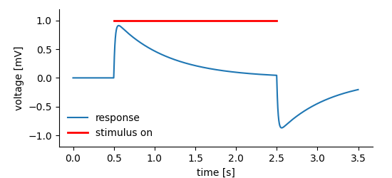

.. toctree::
   :maxdepth: 1

Working with data
=================

Storing data is one thing, but we want to work with it. The following examples illustrate reading of data from *DataArray*, *Tag* and *MultiTag* entities We will use the dummy dataset already used in the :doc:`tagging <./tagging>` example. The figure below shows what is stored in the dataset. 

At some instance in time a system was exposed to a stimulus that leads to the system's response. The response hase been reocrded and stored in a *DataArray* the A *Tag* is used to highlight the "stimulus-on" segment of the data.

.. literalinclude:: examples/taggingExample.py
    :caption: :download:`example code <examples/taggingExample.py>`
    :lines: 78 - 90 

In this example we know the interesting entities by name, i.e. the
*DataArray* is called **response** and the *Tag* is called **stimulus**.
In cases in which we have no clue about the names, we just have to
browse the file or `search <./finding_things.md>`__ by name or type.

Reading data
------------

The first and maybe most common problem is to read the data stored in a
*DataArray*.

Reading all data
~~~~~~~~~~~~~~~~

In *NIX* when you open a *DataArray* the stored the data is **not** automatically read from file. This keeps the object lightweight and easy to create. To read the data you can simpy access the data in a numpy style:

.. literalinclude:: examples/taggingExample.py
    :caption: :download:`example code <examples/taggingExample.py>`
    :lines: 71 - 73 

There are a few noteworthy things:

-  We use some previous knowledge here. For one, we know the names of the entities. Further, we know that the data is 1-D and the single dimension is a ``SampledDimension``. If these things are not known, the NIX library offers the necessary functions to get this information.
-  ``DataArray.shape`` returns a tuple with the data shape.
-  ``DataArray.dtype`` returns the data type.
-  To find out the ``DimensionType``, we need to access the dimension:

.. code-block:: python

    for dim in data_array.dimensions:
        print(dim.dimension_type)

Reading partial data
~~~~~~~~~~~~~~~~~~~~

In other instances it might be wanted to read only parts of the data.
Reading slices of the data ist straight forward using the the numpy style.

.. literalinclude:: examples/taggingExample.py
    :caption: :download:`example code <examples/taggingExample.py>`
    :lines: 98-101

An alternative approach is to use the ``DataArray.get_slice`` method which by default works with indices but can also work in data coordinates. E.g. we know that the data is 1-D and covers a span of 3.5s and we want to have the data in the interval 0.5s through 1.75s. The method returns a ``nixio.DataView`` object. The actual reading is done be accessing the data.

.. literalinclude:: examples/taggingExample.py
    :caption: :download:`example code <examples/taggingExample.py>`
    :lines: 103-106
    :emphasize-lines: 3

The arguments ``positions`` and ``extents`` are passed as lists. There must be one entry for each dimension of the data. In this case, since the data is 1-D, positions and extents are 1-element lists.
Note: the slice is defined by the starting point(s) and the *extent(s)* not with start and end points.

Reading tagged data
~~~~~~~~~~~~~~~~~~~

*Tag* and *MultiTag* tag single or multiple points or regions in data stored in the referenced *DataArrays* (see `tagging <./tagging.md>`__ for more information and the example data created in the `example <#mtag_regions>`__  will be used in the following code snippets).

.. figure:: ./images/multiple_regions.png
    :alt: tagging multiple segments

    Plot of the data created by this :download:`example <examples/multiple_regions.py>` on tagging multiple regions in data. 

In order to read the data that belongs to the highlighted region(s) *Tag* and *MultiTag* define the ``tagged_data`` methods which return ``nixio.DataView`` objects from which the data is read as shown above. The following code snippet shows how to use these function:

.. literalinclude:: examples/multiple_regions.py
   :lines: 86 - 97
   :emphasize-lines: 10
   :caption: Reading data segments tagged by the *Tag* or *MultiTag* can be done using the ``tagged_data`` method (:download:`example code <examples/multiple_regions.py>`).

The *MultiTag* version of the ``tagged_data`` method takes two arguments. The first is the index of the tagged region (0 for the first), the second argument is name (you can also use the index or the id) of the referenced *DataArray*. Since the *Tag* tags only a single region, it only takes one argument, i.e. the name (id, index) of the referenced *DataArray*.

.. figure:: ./images/read_tagged_data.png
   :alt: reading tagged data
   

Analogously, the feature data attached to the *Tag* or *MultiTag* can be
obtained using the ``feature_data`` methods.

.. literalinclude:: examples/multiple_regions.py
   :lines: 69 - 76
   :emphasize-lines: 6, 7
   :caption: ``feature_data`` works analogously, the first argument is the index of the tagged region, the second the name (or id or index) of the feature. Here the feature stores a single number, i.e. the frequency of the stimulus for each tagged region which is plotted below the highlighted regions in the figure above (:download:`example code <examples/multiple_regions.py>`). 

