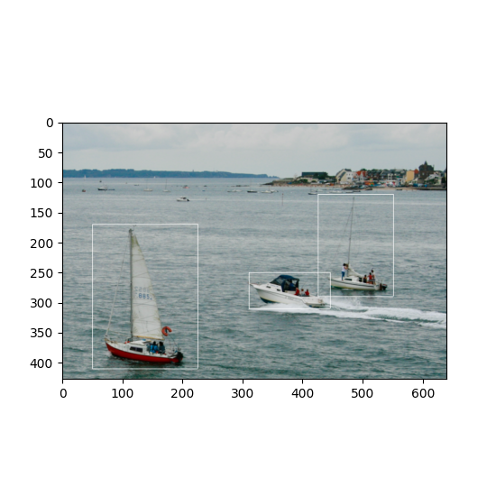

.. toctree::
    :maxdepth: 1

 
Image data
==========

Color images can be stored as 3-D data in a *DataArray*. The first two
dimensions represent *width* and *height* of the image while the 3rd
dimension represents the color channels. Accordingly, we need three
dimension descriptors. The first two are *SampledDimensions* since the
pixels of the image are regularly sampled in space. The third
dimension is a *SetDimension* with labels for each of the channels.
In this tutorial the "Lenna" image is used. Please see the author
attribution in the code.

.. literalinclude:: examples/imageData.py
    :lines: 59-64
    :caption: Image data is just 3-D data that can be easily stored in a *DataArray*. We need to add three dimension descriptors, though (to run the example you need the :download:`example code <examples/imageData.py>` , the :download:`image <examples/boats.png>` *imagemagick* or *xv* packages). 

.. image:: examples/lenna.png
    :alt: lenna
    :width: 240

Tagging regions
---------------

One key feature of the nix-model is its ability to annotate, or "tag", points or regions-of-interest in the stored data. This feature can be used to state the occurrence of events during the recording, to state the intervals of a certain condition, e.g. a stimulus presentation, or to mark the regions of interests in image data. In the nix data-model two types of Tags are discriminated. (1) the **Tag** for single points or regions, and (2) the **MultiTag** to annotate multiple points or regions using the same entity.

.. _single_roi:

Tagging a single point or region
--------------------------------

Single points of regions-of-interest are annotated using a **Tag** object. The Tag contains the start *position* and, optional, the *extent* of the point or region. The link to the data is established by adding the **DataArray** that contains the data to the list of references. It is important to note that *position* and *extent* are arrays with the length matching the dimensionality of the referenced data. The same Tag can be applied to many references as long as *position* and *extent* can be applied to these.

.. literalinclude:: examples/singleROI.py
    :lines: 77-81
    :caption: A *Tag* is used to tag a a single region of interest. Most image data is 3-D with the third dimension representing the color channels (:download:`singleROI.py <examples/singleROI.py>`).

Tagging multiple regions
------------------------

For tagging multiple regions in the image data we again use a *MultiTag* entity.

.. literalinclude:: examples/multipleROIs.py
    :lines: 97 - 122
    :caption: The image data is stored in the very same way as above, the ROIs are defined by their respective start positions and their extents (:download:`example code <examples/multipleROIs.py>`). 

The start positions and extents of the ROIs are stored in two separate *DataArrays*, these are each 2-D, the first dimension represents the number of regions, the second defines the position/extent for each single dimension of the data (height, width, color channels).

The *MultiTag* has a ``tagged_data`` method that is used to retrieve the data tagged by the *MultiTag*.

.. literalinclude:: examples/multipleROIs.py
    :lines: 68 - 73
    :caption: Tagged data is read by using the ``tagged_data`` method. The first argument is the region number, the second the name of the referenced *DataArray* (:download:`example code <examples/multipleROIs.py>`). 

