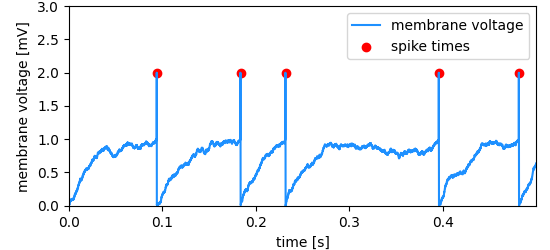
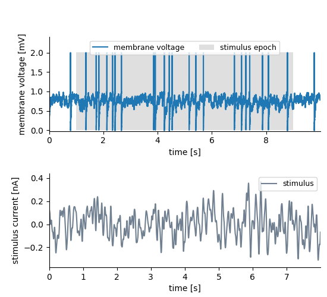
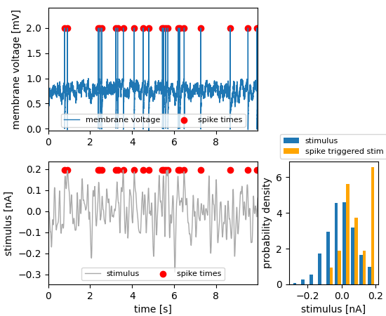
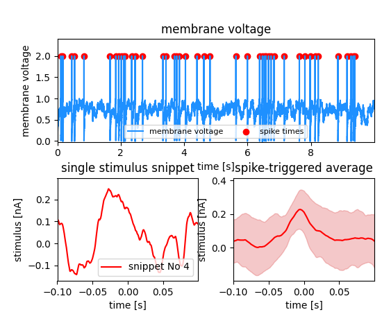

.. _Spike Time Data:

Spike time data
===============

Storing the times of spikes (action potentials) that are generated by neurons is one of the most common use cases.

The data shown below is simulation data created using a Leaky Integrate and Fire (LIF) model neuron. To run the example codes in this section you will need the :download:`lif model <examples/lif.py>`.

.. literalinclude:: examples/spikeTagging.py
    :lines: 58-78
    :caption: We create some simulation data and then use a *MultiTag* to bind the recorded membrane voltage and the spike times together (:download:`example code <examples/spikeTagging.py>`) 

 
    Spike times are marked in a neuron's membrane potential (fake data, created with a LIF model neuron).

Adding features
---------------

The following code shows how to use the **Features** of the NIX-model. Suppose that we have the recording of a signal in which a set of events is detected. Each event may have certain characteristics one wants to store. These are stored as **Features** of the events. There are three different link-types between the features and the events stored in the tag. *nix.LinkType.Untagged* indicates that the whole data stored in the **Feature** applies to the points defined in the tag. *nix.LinkType.Tagged* on the other side implies that the *position* and *extent* have to be applied also to the data stored in the **Feature**. Finally, the *nix.LinkType.Indexed* indicates that there is one point (or slice) in the **Feature** data that is related to each position in the tag.

The following examples show how this works.

.. _untagged_feature:
    
Tagging stimulus segments
-------------------------
    
Let's say we record the neuronal activity and in a certain epoch of that recording a stimulus was presented. This time interval is annotated using a **Tag**. This inidicates the time in which the stimulus was on but we may also want to link the stimulus itself to it. The stimulus is also stored as a **DataArray** and can be linked to the *Tag* as an *untagged* **Feature** of it.

.. literalinclude:: examples/untaggedFeature.py
    :lines: 111-122
    :caption: Source code for this example: :download:`untaggedFeature.py <examples/untaggedFeature.py>`.
    :emphasize-lines: 13

The recorded membrane voltage data is 10s long and we tag the interval between ``stimulus_onset`` and ``stimulus_onset + stimulus_duration`` (from 1 to 9 seconds). The stimulus itself is only 8s long and was played in the tagged interval. We use a *Tag* to bind stimulus and recorded signal together. The data stored in the "untagged" feature is the whole stimulus. The *Tag's* position and extent do not apply to the stimulus trace. 

.. _tagged_feature:

Tagging with spike times
------------------------

Tagged **Features** are used in cases in which the positions and extents of a tag also apply to another linked dataset. In the 
following example the spike times should also be applied to the stimulus that led to the responses. The stimulus is saved in an 
additional **DataArray** and is linked to the spike times as a **Feature** setting the **LinkType** to *tagged*.

.. literalinclude:: examples/taggedFeature.py
    :lines: 52-74
    :caption: Source code for this example: :download:`taggedFeature.py <examples/taggedFeature.py>`.

The spike times are used to tag the recording of the membrane voltage using a *MultiTag*. The stimulus is added to the *MultiTag* as a **tagged** feature. That is, the positions of the tag (the spike times) should be applied also to the stimulus. Extracting the ``feature_data`` gives the stimulus intensities at the times of the spikes, the orange distribution.

.. _indexed_feature:

Storing wavelets as Features of the spike times
-----------------------------------------------

In the example, the signal is the membrane potential of a (model) neuron which was stimulated with some stimulus. The events are again
the action potentials (or spikes) fired by that neuron. A typical analysis performed on such data is the Spike triggered average which
represent the average stimulus that led to a spike. For each spike, a snippet of the respective stimulus is cut out and later averaged. In
this example we store these stimulus snippets and link them to the events by adding a **Feature** to the **MultiTag**. There are three
different flags that define how this link has to be interpreted. In this case there is one snippet for each spike. The index of each
position has to be used as an index in the first dimension of the Feature data. The **LinkType** has to be set to *indexed*.

.. literalinclude:: examples/spikeFeatures.py
    :lines: 130-135
    :caption: From the stimulus, a set of snippets has been extracted and stored in a 2-D DataArray. To be used as an ``Indexed`` feature it must be organized that the first dimension represents the number of snippets. The second dimension is the time. (:download:`example code <examples/spikeFeatures.py>`).

