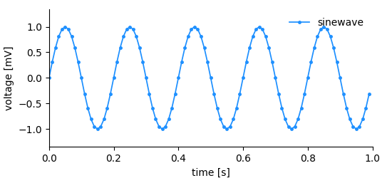
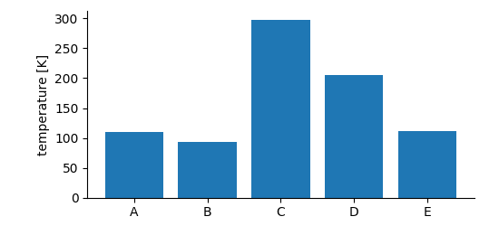
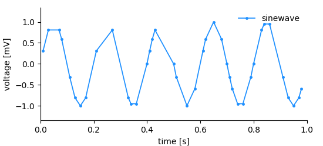
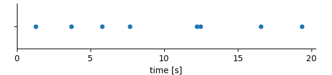
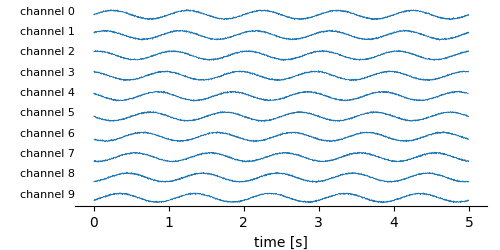

.. toctree::
   :maxdepth: 1

Storing data
============

When storing data, we have two main requirements: 1. We want to be able
to store **n-dimensional** data structures. 2. The data structures must
be **self-explanatory**, that is, they must contain sufficient
information to draw a basic plot of the data.

|sampled_plot| 
.. _sampled_plot:

Considering the simple plot above, we can list all
information that it shows and by extension, that needs to be stored in
order to reproduce it.

-  the data (voltage measurements)
-  the y-axis labeling, i.e. label (voltage) and unit (mV)
-  the x-axis labeling, i.e. label (time) and unit (s)
-  the x-position for each data point
-  a title/legend

In this, and in most cases, it would be inefficient to store x-, and
y-position for each plotted point. The voltage measurements have been done
in regular (time) intervals. Thus, we rather need to store the measured
values and a definition of the x-axis consisting of an offset, the
sampling interval, a label, and a unit.

This is exactly the approach chosen in *NIX*. For each dimension of the
data a **dimension descriptor** must be given. In *NIX* we define three
dimension descriptors:

1. *SampledDimension*: Used if a dimension is sampled at regular
   intervals.
2. *RangeDimension*: Used if a dimension is sampled at irregular
   intervals. The instances at which the data has been sampled are stored as *ticks*. These ticks may also be stored in a *DataArray* or *DataFrame*, the Range Dimension can link to it.
3. *SetDimension*: Used for dimensions that represent categories rather
   than physical quantities.

The DataArray
-------------

The *DataArray* is the most central entity of the *NIX* data model. As
almost all other *NIX*-entities it requires a *name* and a *type*. Both
are not restricted but names must be **unique** within a *Block*. *type*
information can be used to introduce semantic meaning and
domain-specificity. Upon creation, a unique ID will be assigned to the
*DataArray*.

The *DataArray* stores the actual data together with label and unit. In
addition, the *DataArray* needs a dimension descriptor for each data 
dimension. The following snippet shows how to create a *DataArray* and
store data in it.

.. literalinclude:: examples/regularlySampledData.py
   :caption: Storing data in a DataArray (:download:`example code <regularlySampledData.py>`).
   :language: python
   :lines: 57 - 62
   :emphasize-lines: 2

As promised, the *DataArray* contains all information to create a basic plot (see the figure above).

.. literalinclude:: examples/regularlySampledData.py
   :language: python
   :lines: 29 - 40
   :emphasize-lines: 2, 3, 7-8

The highlighted lines emphasize how information from the dimension descriptor (a *SampledDimension*) and the *DataArray* itself are used for labeling the plot.

In the example shown above, the *NIX* library will figure out the
dimensionality of the data, the shape of the data and its type. The data
type and the dimensionality (i.e. the number of dimensions) are fixed
once the *DataArray* has been created. The actual size of the
*DataArray* can be changed during the life-time of the entity.

In case you need more control, *DataArrays* can be created empty for
later filling e.g. during data acquisition.

.. code-block:: python

    data_array = block.create_data_array("sinewave", "nix.sampled", dtype=nix.DataType.Double, shape=(100));

The resulting *DataArray* will have an initial size (100 elements) which
will be automatically resized, if required. The data type is set to
``nixio.DataType.Double``. The *NIX* library will further try to convert passed data to the
defined data type, if possible. **Note:** Data type and rank (i.e. the number of dimensions) cannot be altered after the *DataArray* has been created.

Data is then set by calling

.. code-block:: python

   array.write_direct(voltage)

Data is read from a DataArray by accessing it in numpy style. 

.. code-block:: python

   # read the full data 
   data = array[:]

   # reading only the first 100 points
   data = array[:100]

   # replacing data
   array[:100] = np.zeros(100)

*DataArrays* can also be extended by ``appending`` data.

.. code-block:: python

   data_array = block.create_data_array("test data", "test", data=np.random.randn(100))
   print(array.shape)
   data_array.append(np.ones(100))
   print(array.shape)

Dimensions
==========

Within the *DataArray* we can store n-dimensional data. For each
dimension we must provide a *dimension descriptor*. The following
introduces the individual descriptors.

SampledDimension
----------------

Here we have the same situation as before, the data has been sampled in
regular intervals. That is, the time between successive data points is
always the same. The x-axis can be fully described with just a few
parameters:

1. sampling interval
2. offset
3. label
4. unit

The *SampledDimension* entity is used in such situations and needs to be
added to the *DataArray* entity upon creation:

.. literalinclude:: examples/regularlySampledData.py
   :language: python
   :lines: 58 - 63
   :emphasize-lines: 5
   :caption: A dimension in which the data has been gathered in regular intervals is described using a *SampledDimension* (:download:`example code <examples/regularlySampledData.py>`  

SetDimension
------------

If we need to store data that falls into categories, i.e. the
x-positions are not numeric or the dimension does not have a natural
order, a *SetDimension* is used. It stores a label for each entry along
the described dimension.

.. literalinclude:: examples/categoryData.py
   :language: python
   :lines: 16 - 20
   :caption: A categorical data dimension is described with a *SetDimension* which (optionally) stores labels for each category (:download:`example code <examples/categoryData.py>`)

RangeDimension
--------------

A signal similar to what we had before is recorded but this time the temporal
distance between the measurements is not regular. Storing this kind
of data is not as efficient as in the regularly sampled case since we need to store the time of each measurement and the measured value. The following information needs to be stored to describe the dimension:

1. x-positions of the data points, i.e. *ticks*
2. label
3. unit

In this kind of dimension we store a *range* of ticks, therefore the
name *RangeDimension*. It needs to be added to the *DataArray* when it
is created.

.. literalinclude:: examples/irregularlySampledData.py
   :caption: Storing irregularly sampled data (:download:`example code <examples/irregularlySampledData.py>`).
   :language: python
   :lines: 45 - 60
   :emphasize-lines: 2, 16

**Note:** The *ticks* of a *RangeDimension* must be numeric and ascending.

The *RangeDimension* can do a more. Consider the case that the times of an event are stored:

For example these might be the times of action potentials (aka spikes) recorded in a nerve. In such a case it is basically the x-values that are of interest. It would be inefficient to store them twice, first as values in the *DataArray* and then again as ticks in the dimension descriptor.
In such cases the *RangeDimension* is set up to link to the *DataArray* itself.

.. literalinclude:: examples/rangeDimensionLink.py
   :lines: 12 - 19
   :language: python
   :caption: A *RangeDimension* can link to a *DataArray* as a source of the ticks (:download:`exmaple code <examples/rangeDimensionLink.py>`). 
   :emphasize-lines: 8

In the highlighted line we use a convenience function to establish the link between the dimension descriptor and the 

This function is a shortcut for:

.. code-block:: python

    rdim = data_array.append_range_dimension()
    rdim.create_link(data_array, index=[-1])

In the same way one can set up the *RangeDimension* to use a *DataFrame*. The ``index`` defines which slice of the data stored in the *DataArray/Frame* holds the ticks. The slice must be a 1-D vector within the linked data. If, for example, the *DataArray* is 2-D and the ticks are in the 3rd column then the index would be ``[-1, 3]``. The ``-1`` marks the dimension along which to look for the ticks. When linking *DataFrames* the index notes the column. 

Advanced storing
================

Data compression
----------------

By default data is stored uncompressed. If you want to use data
compression this can be enabled by providing the
``nixio.Compression.DeflateNormal`` flag during file-opening:

.. code-block:: python

   import nixio
   f = nixio.File.open("test.nix", nixio.FileMode.Overwrite, compression=nixio.Compression.DeflateNormal)

By doing this, all data will be stored with compression enabled, if
not explicitly stated otherwise. At any time you can select or deselect
compression by providing a ``nixio.Compression`` flag during *DataArray*
creation. Available flags are:

-  ``nixio.Compression.Auto``: compression as defined during
   file-opening.
-  ``nixio.Compression.DeflateNormal``: use compression (fixed level).
-  ``nixio.CompressionNo``: no compression.

.. code-block:: python

   data_array = b.create_data_array("some data", "nix.sampled", data, compression=nix.Compression.DeflateNormal);

Note the following:

1. Compression comes with a little cost of read-write performance.
2. Data compression is fixed once the *DataArray* has been created, it
   cannot be changed afterwards.
3. Opening and extending an compressed *DataArray* is easily possible
   even if the file has not been opened with the
   ``nixio.Compression.DeflateNormal`` flag.

Supported DataTypes
-------------------

*DataArrays* can store a multitude of different data types. The
supported data types are defined in the ``nixio.DataType`` enumeration:

-  ``nixio.DataType.Bool``: 1 bit boolean value.
-  ``nixio.DataType.Char``: 8 bit charater.
-  ``nixio.DataType.Float``: floating point number.
-  ``nixio.DataType.Double``: double precision floating point number.
-  ``nixio.DataType.Int8``: 8 bit integer, signed.
-  ``nixio.DataType.Int16``: 16 bit integer, signed.
-  ``nixio.DataType.Int32``: 32 bit integer, signed.
-  ``nixio.DataType.Int64``: 64 bit integer, signed.
-  ``nixio.DataType.UInt8``: 8 bit unsigned int.
-  ``nixio.DataType.UInt16``: 16 bit unsigned int.
-  ``nixio.DataType.UInt32``: 32 bit unsigned int.
-  ``nixio.DataType.UInt64``: 64 bit unsigned int.
-  ``nixio.DataType.String``: string value.
-  ``nixio.DataType.Opaque``: data type for binary data.

The data type of a *DataArray* must be specified at creation time and
cannot be changed. In many cases, the *NIX* library will try to handle
data types transparently and cast data to the data type specified for
the *DataArray* in which it is supposed to be stored.

Extending datasets on the fly
-----------------------------

The dimensionality (aka rank) and the stored *DataType* of a *DataArray*
are fixed. The actual size of the stored dataset, however, can
changed. This is often used when you acquire data continuously e.g. while
recording during an experiment. In nixpy the resizing is handled transparently.

The workflow would be:

1. Preparations: Open a nix-file in ``nixio.FileMode.ReadWrite`` or
   ``nixio.FileMode.Overwrite``. Create or open the *DataArray*.
2. Acquire more data.
3. Append the acquired data to the data array.
4. Acquire more data.

The following code shows how this works.

.. literalinclude:: examples/continuousRecording.py
   :caption: Extending *DataArray* size e.g while recording continuously (:download:`example code <examples/continuousRecording.py>`) 
   :lines: 47-66
   :language: python

**Note!** Selecting the initial shape defines the chunk size used to
write the data to file. Choose it appropriately for the expected size
increment. Selecting a size that is too small can severly affect
efficiency.

