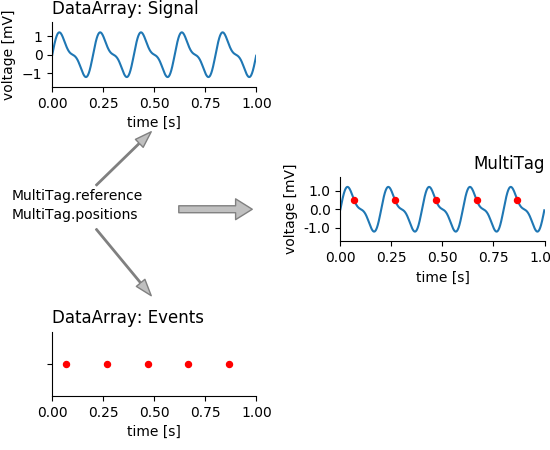
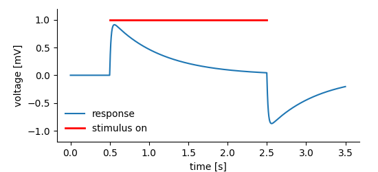
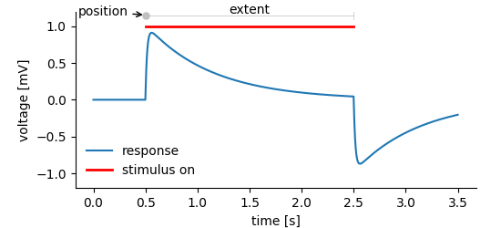
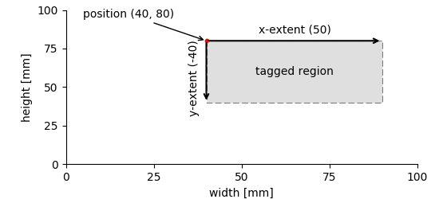
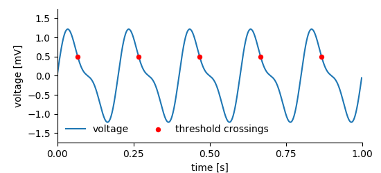
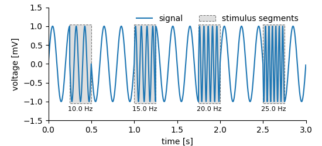
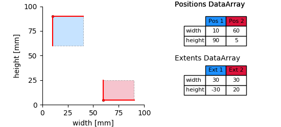
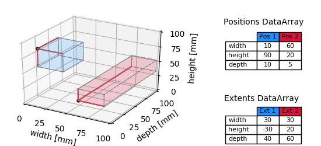

.. toctree::
   :maxdepth: 1

Tagging points and regions
==========================

The *DataArray*\ s store data, but this is not all that is needed to
store scientific data. We may want to highlight points or regions in the
data and link it to further information.

This is done using the *Tag* and the *MultiTag*, for tagging single or
multiple points or regions, respectively.

The basic idea is that the *Tag* defines the point (and extent) with
which it refers to points (or regions) in the data. A tag can point to
several *DataArrays* at once. These are mere links that are stored in
the list of *references*. The following figure illustrates, how a
*MultiTag* links two *DataArrays* to create a new construct.

   *MultiTags* tag several points or regions in referenced *DataArrays*. By binding entities together they can provide context.

Tagging in 1D
-------------

Suppose, we are recording the response of a system to a certain
stimulus.

   A system’s response to a stimulus that was on for a certain amount of time.

We may want to store:

1. The recorded system’s response before, during, and after the
   stimulus.
2. The time span, the stimulus was on.

In the *NIX* data model *Tag* entities are used to tag regions in a
*DataArray*. For this, the *Tag* refers to the *DataArray* and stores
**position** and **extent** of the highlighted segment.

   The system's response is stored in a *DataArray* we do need to add information about the start position and the extent of the stimulus-on segment. The extent is optional, if not specified. the *Tag*/*MultiTag* tags only a point in the data.

The following code snippet shows how to create the *Tag*.

.. literalinclude:: examples/tagging_example.py
    :caption: Creating a Tag for a time span in recorded data :download:`example code <examples/tagging_example.py>`
    :lines: 78 - 90 

Line 11 creates the *Tag* with the start position and in line 12 we add the extent of the tagged segment. In line 13 we add the *DataArray* we want to point at to the list of *references*. A Tag can refer to more than just a single *DataArray*. Both position and extent are passed as lists with one entry for each dimension of the data. If the length of e.g. position is less than number of dimensions in the referenced *DataArray* it is assumed that the tag refers to the full extent of the non-restricted dimensions. The same applies to missing extents. For the sake of clearness it is advisable to fully specify the positions and extents.
 
**Note!** Position and extent of the tagged region are given as
lists. Extent is optional, not setting it tags a point instead
of a segment of the referenced data.

Tagging in 2D
-------------

The same principle shown above for 1-D data extends to two or more dimensions. The only difference is that one has to provide vectors of positions/extents whose length matches the number of dimensions of the referenced *DataArray*.

   Tagging works also in 2-D. In this case, position and extent must 2-element vectors (one entry for each dimension). 

Tagging multiple points in 1D
-----------------------------

Often it is not a single point or region but a multitude of points that we want to note in a recorded signal. In the following situation a signal has been recorded and within this signal certain events, threshold crossings have been detected (figure below).

   

For storing this kind of data we need two *DataArrays*, the first stores the recorded signal, the other the events. Finally, a *MultiTag* entity is used to link both. One can use the event times stored in one of the *DataArrays* to tag multiple points in the other signal.

.. literalinclude:: examples/multiple_points.py
    :lines: 49-61
    :caption: To mark several points in a recorded signal we use a *MultiTag* to bind the signal and event times ( :download:`example code <examples/multiple_points.py>`) 

Creating the *MultiTag* is very similar to the creation of the simpler *Tag* above. The main difference is that the tagged positions are not stored in the *MultiTag* itself but we use the event *DataArray* (events in the code example) for this purpose. Finally, the signal *DataArray* is added to the list of references.

Tagging multiple intervals in 1D
--------------------------------

A very similar approach is taken for tagging multiple intervals in which,
for example, a stimulus was switched on.

   With a *MultiTag* we can also tag multiple regions in a signal.

For storing such data we again need one *DataArray* to store the recorded signal. Storing the regions is similar to the approach for the simpler *Tag*, i.e. *positions* and the *extents* need to be provided. Accordingly, **two** additional *DataArray*\ s are required. The first of which stores the positions and the second the extents of the tagged regions. 

.. literalinclude:: examples/multiple_regions.py
   :caption: The following code tags multiple regions in a 1-D signal (:download:`example code <examples/multiple_regions.py>`).
   :lines: 27 - 38, 44-46 

The example code is rather straight forward. The *DataArrays* ‘positions’ and ‘extents’ take respective data and are added to the created *MultiTag* entity. Finally, the *DataArray* in which we tag the regions is added to the list of *references* of the *MultiTag*.

Tagging in n-D
--------------

The same principle as demonstrated above applies also to n-dimensional data. Tagging in n dimensions requires **positions** and **extents** stored in *DataArrays* of appropriate shapes.

The following figures show the tagging of multiple regions in 2- and 3D.

   Tagging multiple regions in n-D data requires the *DataArrays* for storing positions and extents to be two-dimensional. The first dimension represents the number of regions, the second has as many entries as the referenced data.
 
According to the number of dimensions of the data (here, width and height) each  starting point and the extent of a tagged region is defined by two numbers. Thus, the **position** and **extent** *DataArrays* are two dimensional. The first dimension represents the number of tagged regions, the second the number of dimensions.

This approach can be extended into n-D. The following figure illustrates the 3-D case.

   multiple_regions_3D_plot

The only things that need to be changed in the above code, are the layout of the data (now 3-dimensional) and further entries into **position** and **extent** *DataArrays* along the second dimension (compare tables in the figure). Again, these *DataArrays* are **always** 2D, the first dimension represents the number of tagged regions, the second the number of dimensions.

For an example see :ref:`Image Data`.

Adding features
---------------

We use the above example to increase complexity a bit. So far, the *MultiTag* ‘mtag’ just notes that in the data stored in ‘array’ there are some interesting intervals in which something happened. The name of the *MultiTag* entity tells us that the highlighted intervals represent stimulus regions. Using *Features* we can now add further information to these regions. Let’s assume we wanted to store the stimulus frequency. The following lines of code can be inserted into the previous example
before the file is closed.

.. literalinclude:: examples/multiple_regions.py
   :caption: The following code tags multiple regions in a 1-D signal and adds a feature describing the tagged regions (:download:`example code <examples/multiple_regions.py>`).
   :lines: 40 - 47 
   :emphasize-lines: 8

The feature data is used to create the text labels below the segments in the plot above (:ref:`above<Tagging multiple intervals in 1D>`). Each entry in the frequencies *DataArray* corresponds to one of the tagged sections. Thus we use the ``nixio.LinkType.Indexed`` flag while creating the feature. We can read the feature data that belongs to the respective position index by calling the ``feature_data`` method on the *MultiTag*.

.. literalinclude:: examples/multiple_regions.py
   :caption: :download:`example code <examples/multiple_regions.py>`.
   :lines: 73-75 

The *Feature* adds the information stored in a *DataArray* to the *Tag/MultiTag*. The way this information has to be interpreted is specified via the *LinkType*. There are three distinct types:

1. **Indexed**: For each position in the referring *Tag/MultiTag* there
   is one entry in the linked *DataArray*. In case the linked
   *DataArray* is multi-dimensional, the number of entries along
   dimension 0 must match the number of positions.
2. **Tagged**: Positions and extents of the referring *Tag/MultiTag*
   need to be applied in the same way to the linked *DataArray* as to
   the referenced data (stored in the ‘references’ list).
3. **Untagged**: The whole data stored in the linked Feature is a
   feature of the *Tag/MultiTag* ignoring any indexing, positions or
   extents.

For more examples see the :ref:`Spike Time Data` tutorial.

Handling of units
=================

In the above example we do not explicitly specify a unit for position and extent. They are implicitly assumed to be given in the same unit as the *DataArray*. It is, however, possible to specify a unit (or rather a unit for each dimension), if this is more convenient. For example, it would be possible to give position and extent in *milliseconds* while the *DataArray* is specified in *seconds*. The library will try to convert the units transparently. The library does no validation at the time of *Tag* creation. It is the user’s responsibility that units match or are scalable. Unit conversion works only for SI units and is ignorant of physical connections between units. That is, we can work with *W* and *mW* but can **not** scale *mW* and *VA* (milli Watts and Volt * Ampere).
