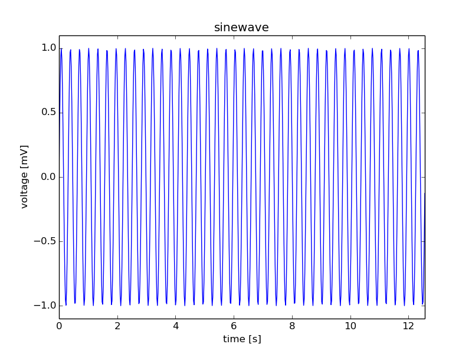
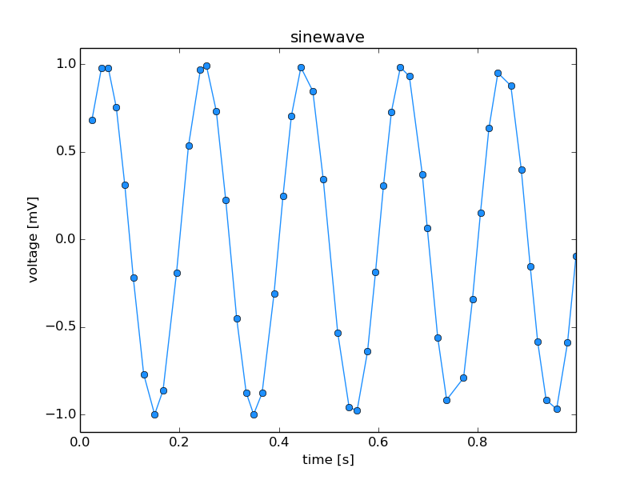
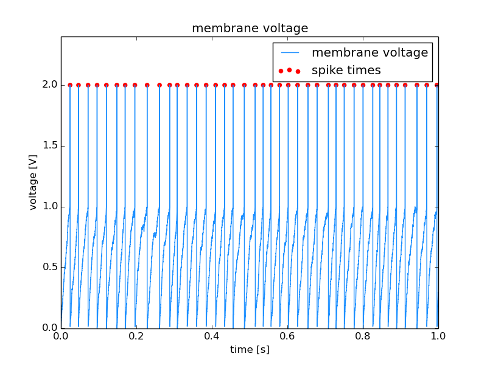
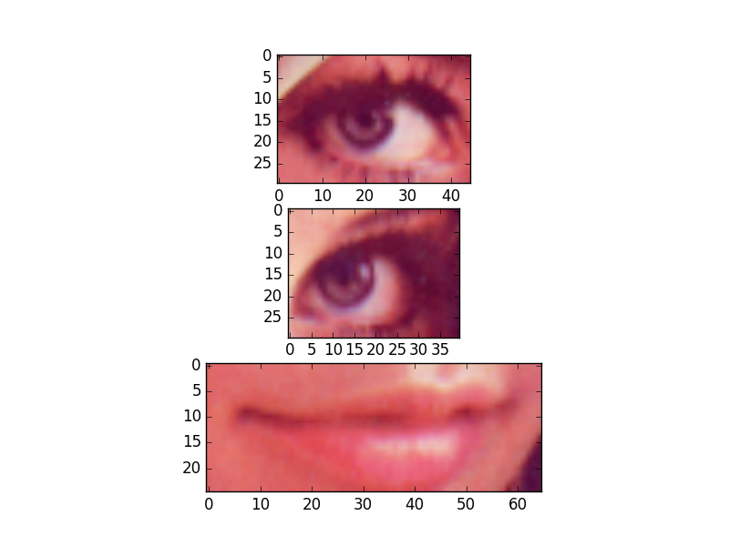
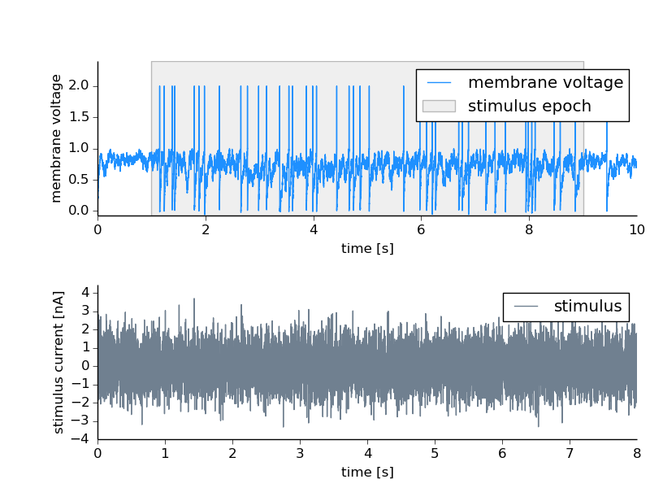

=========
Tutorials
=========

The following tutorials show how to work with NIX files, to store
different kinds of data, tag points or regions of interest and add
further information to the data.

.. _toc:

List of Tutorials
=================
* Working with files

  * :ref:`working_with_files`

* Basic data structures

  * :ref:`regularly_sampled_data`
  * :ref:`irregularly_sampled_data`
  * :ref:`event_data`
  * :ref:`multiple_signals`
  * :ref:`image_data`

* Tagging points and regions-of-interest

  * :ref:`single_roi`
  * :ref:`multiple_rois`
  * :ref:`spike_tagging`

* Features

  * :ref:`untagged_feature`
  * :ref:`tagged_feature`
  * :ref:`indexed_feature`

* Retrieve data 
 
  * :ref:`retrieve_tagged_data`
  * :ref:`retrieve_feature_data`

* Additional information

  * :ref:`sources`
  * :ref:`metadata`

.. _working_with_files:

Working with Files
==================

The following code shows how to create a new nix-file, close it and
re-open them with different access rights (examples/fileCreate.py).

.. literalinclude:: examples/fileCreate.py

Source code of this example: `fileCreate.py`_.

.. _fileCreate.py: examples/fileCreate.py

Selecting a backend
"""""""""""""""""""

The `open` method supports specifying a NIX backend with the `backend` argument.
The H5Py backend is always available.

.. code-block:: python

    file = nix.File.open(file_name, nix.FileMode.Overwrite, backend="h5py")

Alternatively, if `NIX`_ is installed and NIXPy was built with NIX support, the
HDF5 backend can be specified.

.. code-block:: python

    file = nix.File.open(file_name, nix.FileMode.Overwrite, backend="hdf5")

See the :ref:`advanced installation` instructions for details on installing
NIXPy with NIX HDF5 backend support.

When no backend is specified, HDF5 is used if available, otherwise the library
defaults to H5Py.

:ref:`toc`

.. _NIX: https://github.com/G-Node/nix

Basic data structures
=====================

In this section we will show how different kinds of data are stored in
nix files. We will start with simple regularly and irregularly sampled
signals, turn to series of such signals and end with images stacks.

.. _regularly_sampled_data:

Regularly sampled data 
"""""""""""""""""""""" 

Regularly sampled data is everything which is sampled in regular
intervals in space, time, or something else. Let's consider a signal
that has been digitized using an AD-Converter at a fixed sampling
rate. In this case the axis representing time has to be described
using a **SampledDimension**. This dimension descriptor contains as
mandatory element the *sampling_interval*. The *sampling_interval* has
to be given because it also applies e.g. to spatial sampling, it is
the more general term than the sampling rate which may appear
appropriate for time discretization. Further, the *unit* in which this
number has to be interpreted and a *label* for the axis can be
specified. The following code illustrates how this is stored in nix
files.

.. literalinclude:: examples/regularlySampledData.py
		    :lines: 53-66    

Source code for this example: `regularlySampledData.py`_.

.. _regularlySampledData.py: examples/regularlySampledData.py

:ref:`toc`

.. _irregularly_sampled_data:

Irregularly sampled data
""""""""""""""""""""""""

Irregularly sampled data is sampled at irregular intervals. The
dimension which is sampled in this way has to be described using a
**RangeDimension**. This dimension descriptor stores besides the
*unit* and *label* of the axis the ticks, e.g. time-stamps of the
instances at which the samples were taken.

.. literalinclude:: examples/irregularlySampledData.py
		    :lines: 57-63 

Source code for this example: `irregularlySampledData.py`_.

.. _irregularlySampledData.py: examples/irregularlySampledData.py

:ref:`toc`

.. _event_data:

Event data
""""""""""""""""""

TODO

.. _multiple_signals:

Series of signals
"""""""""""""""""

It is possible to store multiple signals that have the same shape and
logically belong together in the same *DataArray* object. In this
case, the data is two-dimensional and two dimension-descriptors are
needed. Depending on the layout of the data one dimension represents
time and is described with a *SampledDimension* while the other
represents the various signals. This is described with a
*SetDimension*. A *SetDimension* can have labels for each entry along
this dimension of the data.

.. literalinclude:: examples/multipleTimeSeries.py
		    :lines: 66-76

.. image:: examples/multiple_time_series.png
	   :width: 240

Source code for this example: `multipleTimeSeries.py`_.

.. _multipleTimeSeries.py: examples/irregularlySampledData.py

:ref:`toc`

.. _image_data:

Image data
""""""""""

Color images can be stored as 3-D data in a *DataArray*. The first two
dimensions represent *width* and *height* of the image while the 3rd
dimension represents the color channels. Accordingly, we need three
dimension descriptors. The first two are *SampledDimensions* since the
pixels of the image are regularly sampled in space. The third
dimension is a *SetDimension* with labels for each of the channels.
In this tutorial the "Lenna" image is used. Please see the author
attribution in the code.

.. literalinclude:: examples/imageData.py
		    :lines: 59-66

.. image:: examples/lenna.png
	   :width: 240

if the image is not shown install *imagemagick* or *xv* tools (Linux)
Source code for this example: `imageData.py`_.

.. _imageData.py: examples/imageData.py

:ref:`toc`

Tagging regions
===============

One key feature of the nix-model is its ability to annotate, or "tag",
points or regions-of-interest in the stored data. This feature can be
used to state the occurrence of events during the recording, to state
the intervals of a certain condition, e.g. a stimulus presentation, or
to mark the regions of interests in image data. In the nix data-model
two types of Tags are discriminated. (1) the **Tag** for single points
or regions, and (2) the **MultiTag** to annotate multiple points or
regions using the same entity.

.. _single_roi:

Single point or region
""""""""""""""""""""""

Single points of regions-of-interest are annotated using a **Tag**
object. The Tag contains the start *position* and, optional, the
*extent* of the point or region. The link to the data is established
by adding the **DataArray** that contains the data to the list of
references. It is important to note that *position* and *extent* are
arrays with the length matching the dimensionality of the referenced
data. The same Tag can be applied to many references as long as
*position* and *extent* can be applied to these.

.. literalinclude:: examples/singleROI.py
		    :lines: 80-84

.. image:: examples/single_roi.png
	   :width: 240

Source code for this example: `singleROI.py`_.

.. _singleROI.py: examples/singleROI.py

:ref:`toc`

.. _multiple_rois:

Multiple points or regions
""""""""""""""""""""""""""

For tagging multiple regions of interest in the same data the
**MultiTag** object is used. Unlike the simple **Tag** from the
previous example, the multiple *positions* and *extents* can be
given. These are stored in **DataArray** objects. The tagged dataset
is linked via the references.  There are some restrictions regarding
the **DataArrays** storing positions and extents. The data stored in
them **must** be 2-dimensional. Both dimensions are **SetDimensions**
representing the individual positions and the positions in the
referenced data, respectively. Thus, the second dimension has as many
entries as the referenced data has dimensions.

In the following example we will declare multiple ROIs in a image. The
image as a spatial extent and three color channels, is hence 3-D. The
same mechanism can, of course, be used to tag other event in different
kinds of data. For example in the neuroscience context: the detection
of action potentials in a recorded membrane potential.

.. literalinclude:: examples/multipleROIs.py
		    :lines: 94-107

.. image:: examples/multi_roi.png
	   :width: 240

Source code for this example: `multipleROIs.py`_.

.. _multipleROIs.py: examples/multipleROIs.py

:ref:`toc`

.. _spike_tagging:

Tagging spikes in membrane potential
""""""""""""""""""""""""""""""""""""

Neuroscience example. The same construct as above is used to mark the
times at which action potentials were detected in the recording of a
neuron's membrane potential.

.. literalinclude:: examples/spikeTagging.py
		    :lines: 67-82

Source code for this example: `spikeTagging.py`_.

.. _spikeTagging.py: examples/spikeTagging.py

:ref:`toc` 

.. _retrieve_tagged_data:

Retrieving tagged regions
"""""""""""""""""""""""""

Tagging regions of interest in one thing but retrieving the tagged
data slice is another. The **Tag** and **MultiTag** entities offer a
function for this. Consider the image example from above:

.. image:: examples/multi_roi.png
	   :width: 240

Three regions were tagged. To retrieve the respective data the
following code has to be executed:

.. literalinclude:: examples/multipleROIs.py
		    :lines: 62-64

Source code for this example: `multipleROIs.py`_.

.. _multipleROIs.py: examples/multipleROIs.py
		

:ref:`toc`

Unit support in tagging
"""""""""""""""""""""""

TODO

:ref:`toc`

.. _features:

Features
========

The following code shows how to use the **Features** of the
NIX-model. Suppose that we have the recording of a signal in which a
set of events is detected. Each event may have certain characteristics
one wants to store. These are stored as **Features** of the
events. There are three different link-types between the features and
the events stored in the tag. *nix.LinkType.Untagged* indicates that
the whole data stored in the **Feature** applies to the points defined
in the tag. *nix.LinkType.Tagged* on the other side implies that the
*position* and *extent* have to be applied also to the data stored in
the **Feature**. Finally, the *nix.LinkType.Indexed* indicates that
there is one point (or slice) in the **Feature** data that is related
to each position in the Tag.

The following examples show how this works.

.. _untagged_feature:

Untagged Feature
""""""""""""""""

Let's say we record the activity of a neuron and at a certain epoch of
that recording a stimulus was presented. This time interval is
annotated using a **Tag**. This inidicates the time in which the
stimulus was on but we may also want to link the stimulus trace to
it. The stimulus is also stored as a **DataArray** in the file and can
be linked to the stimulus interval as an *untagged* **Feature** of it.

.. literalinclude:: examples/untaggedFeature.py
		    :lines: 119-126

Source code for this example: `untaggedFeature.py`_.

.. _untaggedFeature.py: examples/untaggedFeature.py

:ref:`toc` 

.. _tagged_feature:

Tagged Feature
""""""""""""""

Tagged **Features** are used in cases in which the positions and
extents of a tag also apply to another linked dataset. In the
following example the spike times should also be applied to the
stimulus that led to the responses. The stimulus is saved in an
additional **DataArray** and is linked to the spike times as a
**Feature** setting the **LinkType** to *tagged*.

.. literalinclude:: examples/taggedFeature.py
		    :lines: 108-122

.. image:: examples/tagged_feature.png
	   :width: 240

Source code for this example: `taggedFeature.py`_.

.. _taggedFeature.py: examples/taggedFeature.py

:ref:`toc` 

.. _indexed_feature:

Indexed Feature
"""""""""""""""

In the example, the signal is the membrane potential of a (model)
neuron which was stimulated with some stimulus. The events are again
the action potentials (or spikes) fired by that neuron. A typical
analysis performed on such data is the Spike triggered average which
represent the average stimulus that led to a spike. For each spike, a
snippet of the respective stimulus is cut out and later averaged. In
this example we store these stimulus snippets and link them to the
events by adding a **Feature** to the **MultiTag**. There are three
different flags that define how this link has to be interpreted. In
this case there is one snippet for each spike. The index of each
position has to be used as an index in the first dimension of the
Feature data. The **LinkType** has to be set to *indexed*.

.. literalinclude:: examples/spikeFeatures.py
		    :lines: 135-147

.. image:: examples/spike_feature.png
	   :width: 240

Source code for this example: `spikeFeatures.py`_.

.. _spikeFeatures.py: examples/spikeFeatures.py

:ref:`toc`

.. _retrieve_feature_data:

Retrieving feature data
"""""""""""""""""""""""

The above sections have shown how to attach features to tagged
regions. To get the feature data back there are two ways. (i) You can
access the data via the selected feature as it is shown in the
`spikeFeatures.py`_. example (line 61).

.. literalinclude:: examples/spikeFeatures.py
		    :lines: 61

With this line of code you get all the data stored in the Feature as
one numpy array.  If you want to get the feature data that is related
to a singe point (or region) one can call (line 62):

.. literalinclude:: examples/spikeFeatures.py
		    :lines: 62

with the first argument being the index of the position and the second
one that of the feature. In case of **Tag** entities, there is only
one argument that is the index of the feature you want the data from.

:ref:`toc`

.. _sources:

Storing the origin of data
==========================

Let's assume we want to note the origin of the data. For example they
have been obtained from a certain experiment or an experimental
subject. For this purpose **Source** entities are used.  Sources can
be nested to reflect dependencies between different sources. For
example One may record data from different neurons in the same brain
region of the same animal.

.. code-block:: python

		# create some source entities
		subject.block.create_source('mouese A', 'nix.experimental_subject')
		brain_region = subject.create_source('hippocampus', 'nix.experimental_subject')
		cell_1 = brain_region.create_source('CA1 1', 'nix.experimental_subject')
		cell_2 = brain_region.create_source('CA1 2', 'nix.experimental_subject')
		# add them to the data.
		da1 = block.create_data_array("cell1 response", "nix.regular_sampled", data=response_1)
		da1.sources.append(cell_1)
		da2 = block.create_data_array("cell2 response", "nix.regular_sampled", data=response_2)
		da2.sources.append(cell_2)

The **Sources** can be used to indicate links between data that cannot
be reflected by the data itself.

:ref:`toc`

.. _metadata:

Adding arbitrary metadata
=========================

Almost all entities allow to attach arbitray metadata. The basic
concept of the metadata model is that **Properties** are oragnized in
**Sections** which in turn can be nested to represent hierarchical
structures. The **Sections** basically act like python
dictionaries. How to create sections and properties is demonstrated by
attaching information about the 'Lenna' image used above.

.. literalinclude:: examples/imageWithMetadata.py
		    :lines: 48-58, 82

Source code for this example: `imageWithMetadata.py`_.

.. _imageWithMetadata.py: examples/imageWithMetadata.py

.. image:: examples/image_with_metadata.png
	   :width: 240

:ref:`toc`
